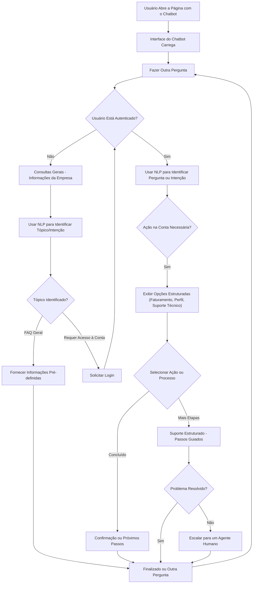

```mermaid
flowchart TB
    A0["Usuário Abre a Página com o Chatbot"] --> A1["Interface do Chatbot Carrega"]
    A1 --> A2["Chatbot Cumprimenta e Oferece Ajuda"]

    A2 --> B1{"Usuário Está Autenticado?"}

    %% Para Usuários Não Autenticados
    B1 -- "Não" --> C1["Consultas Gerais - Informações da Empresa"]
    C1 --> C2["Usar NLP para Identificar Tópico/Intenção"]
    C2 --> C3{"Tópico Identificado?"}
    C3 -- "FAQ Geral" --> C4["Fornecer Informações Pré-definidas"]
    C4 --> D1["Usuário Encerra Sessão ou Faz Outra Pergunta"]
    C3 -- "Requer Acesso à Conta" --> C5["Solicitar Login"]
    C5 --> B1

    %% Para Usuários Autenticados
    B1 -- "Sim" --> E1["Usar NLP para Identificar Pergunta ou Intenção"]
    E1 --> E2{"Ação na Conta Necessária?"}
    E2 -- "Sim" --> E3["Exibir Opções Estruturadas (Faturamento, Perfil, Suporte Técnico)"]
    E3 --> E4{"Selecionar Ação ou Processo"}
    E4 -- "Concluído" --> F1["Confirmação ou Próximos Passos"]
    E4 -- "Mais Etapas" --> F2["Suporte Estruturado - Passos Guiados"]
    F1 --> D1
    F2 --> F3{"Problema Resolvido?"}
    F3 -- "Sim" --> D1["Finalizado ou Outra Pergunta"]
    F3 -- "Não" --> G1["Escalar para um Agente Humano"]

    D1 --> A2["Fazer Outra Pergunta"]
    G1 --> D1

```